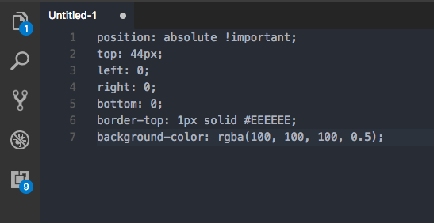
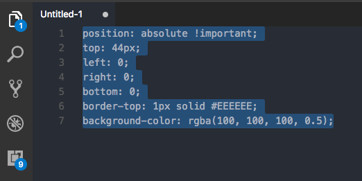
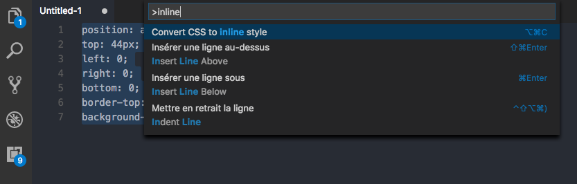
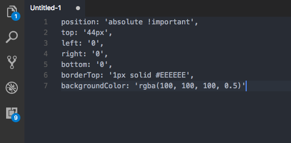

# css2inlinestyle README

css2inlinestyle is a simple extension to convert CSS code to inline style javascript code as you can use in ReactJs or ReactNative.

## Features

- Convert css to inline style.
- Remove prefixes
- If find duplicate rules, check their values. If the values are similar, just keep one of them. If their values are differents, keep the duplicate values and display a warning message.

### Open the CSS file

### Select the code you want to convert

### Execute the command

### Enjoy

## Release Notes

### 1.0.0

Initial release of css2inlinestyle
